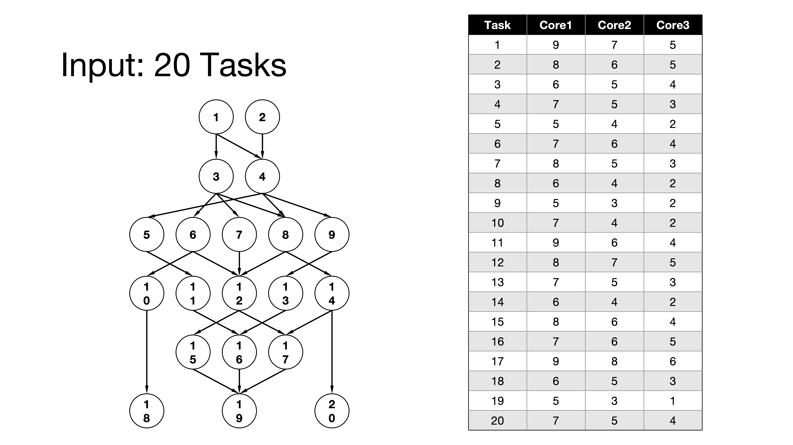
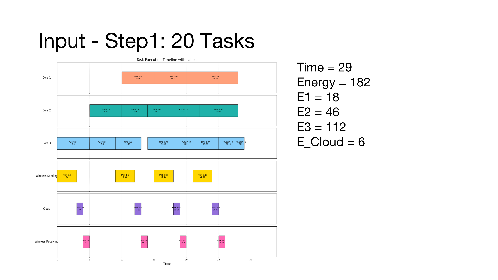
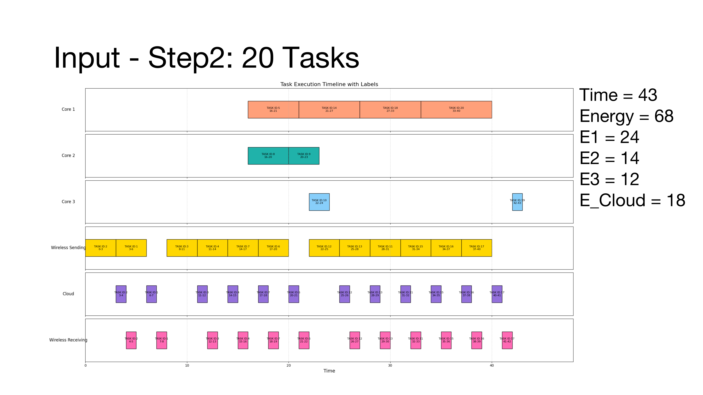

# Energy and Performance-Aware Task Scheduling in MCC

This repository reproduces the results of the paper:  
**"Energy and Performance-Aware Task Scheduling in a Mobile Cloud Computing Environment"**.

---

## Overview

The project implements the task scheduling algorithms and experiments discussed in the paper to validate the findings. Key features include:

- **Implementation**: Algorithms were developed in **C++** to replicate the scheduling process and generate output results.  
- **Visualization**: Output data was analyzed and visualized using **Python**, providing clear and insightful representations of the findings.

---

## Visualization Outputs

Below are some examples of the visualized results generated from the reproduced experiments:

### Example with 20 Tasks: 

### [Step 1]

### [Step 2]

